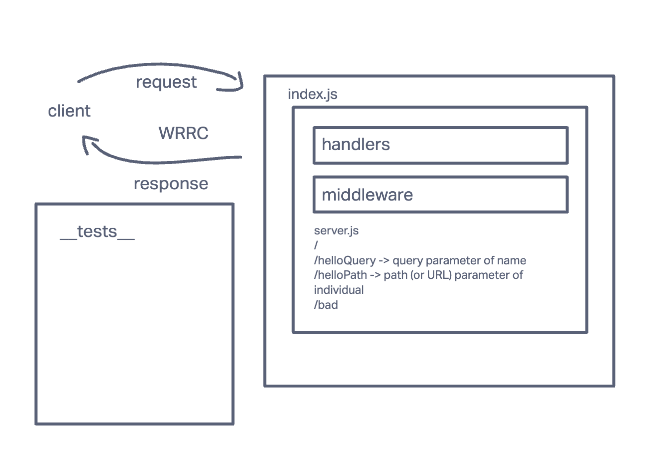

# basic-express-server

# server-deployement-practice

## Author
Camilla Rees

## Problem Domain
Web server using CI and CD and get used to the general process of building and deploying servers

## Links and Resources

1. [Deployed Main Branch](https://server-deployment-practice-camilla-rees.onrender.com/)
2. [Pull Request 1](https://github.com/camillarees/server-deployement-practice/pull/1)
3. [Pull Request 2](https://github.com/camillarees/server-deployement-practice/pull/2)

## Setup

1. See .env.sample
2. PORT: 3001

## How to initialize

1. nodemon

## Features/Routes

1. Deploy to dev
    - GET: '/'
    - GET: 'bad'

2. Deploy to main
    - GET: '/hello'
    - GET: 'bad'

## Tests

1. npm test
    - handles root path
    - handles invalid requests
    - handles errors

## UML

